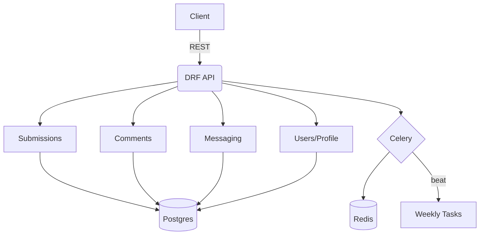

# FILEFORUM

A forum-like service for seamless file sharing with short links. Backend-first: Django + DRF, Postgres, Redis/Celery. Local file storage in development.

## OVERVIEW

- Share files via submissions under `/s/<slug>` (8-char alphanumeric; admins can set custom unique slugs).
- Per-submission roles: owner, editor, viewer; owners can manage members.
- Visibility: public, private, link_only + `registered_only` boolean.
- Voting: up/down mapped to 0–5 stars (percentage-based).
- Reporting: admin-only triage in Django admin.
- Comments (threaded), messaging, rate limits, weekly trending, and cleanup.

## TECH STACK

- Python 3.11.14, Django 4.2, DRF
- Postgres (dev via docker-compose), Redis (broker/result for Celery)
- Celery + django-celery-beat (weekly tasks)
- django-safedelete, django-guardian, django-ratelimit
- Markdown + bleach sanitization

## ARCHITECTURE



```mermaid
sequenceDiagram
  participant U as User
  participant API as DRF API
  participant DB as Postgres
  participant R as Redis/Celery
  U->>API: POST /api/submissions/
  API->>DB: Create Submission (slug)
  API-->>U: 201 Created (slug)
  U->>API: POST /api/submissions/{id}/files/
  API->>DB: Save files (folder path)
  API-->>U: 201 Created
  Note over U,API: Upvote/downvote => stars; reports go to admin.
```

## QUICKSTART

1) Install tools
- pyenv 3.11.14 and Poetry
- Docker (for Postgres)

2) Install deps

```sh
pyenv install -s 3.11.14
pyenv local 3.11.14
poetry env use 3.11.14
poetry install
```

3) Configure environment

```sh
cp .env.example .env
# EDIT .ENV (POSTGRES_*, REDIS_URL, SECRET_KEY, RATE LIMITS, ETC.)
```

4) Start Postgres

```sh
docker compose up -d postgres
```

5) Migrate and run

```sh
poetry run python manage.py makemigrations
poetry run python manage.py migrate
poetry run python manage.py runserver
```

6) Celery (optional during dev)

```sh
poetry run celery -A config worker -l info
poetry run celery -A config beat -l info
```

7) Create admin

```sh
poetry run python manage.py createsuperuser
# LOGIN: /ADMIN/
```

## FORMATTING & TESTS

- Black: `bash scripts/format.sh` or `bash scripts/format.sh check`
- Pytest: `poetry run pytest -q` or `poetry run pytest --cov`

## SAFE RESET (POSTGRES)

```sh
bash scripts/reset.sh
```

## API SMOKE EXAMPLES

```sh
# LIST SUBMISSIONS
curl -s http://127.0.0.1:8000/api/submissions/

# CREATE SUBMISSION (JWT REQUIRED)
http POST :8000/api/submissions/ title='My share' visibility='public' \
  "Authorization:Bearer $ACCESS_TOKEN"

# UPLOAD FILE TO A SUBMISSION
http -f POST :8000/api/submissions/1/files/ file@./README.md \
  "Authorization:Bearer $ACCESS_TOKEN"

# VOTE AND READ RATING
http POST :8000/api/submissions/1/upvote/ "Authorization:Bearer $ACCESS_TOKEN"
http GET  :8000/api/submissions/1/votes
```

## DOCS
See docs/ for detailed architecture, data model, roles/permissions, rate limits, tasks, and contributing guidelines.
