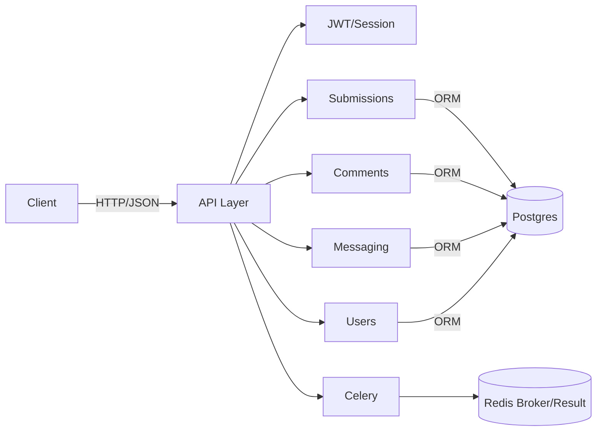

# Architecture

Key flows:
- Upload: create submission -> upload files -> organize into folders.
- Visibility: PUBLIC/PRIVATE/LINK_ONLY + registered_only flag.
- Roles: owner/editor/viewer per submission; owner manages members.
- Voting: per-user up/down; rating derived; trending via Wilson LB.
- Reports: stored and triaged in admin only.
