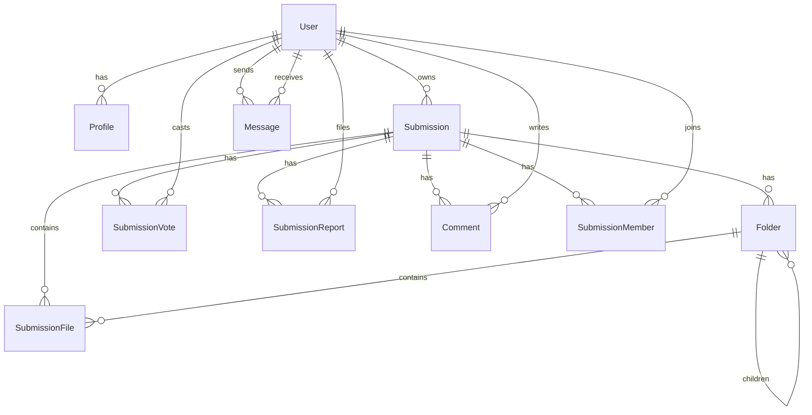

# Data Model

- Profile: blocked_users M2M to User, badges via flags/is_staff/is_superuser.
- Submission: slug (unique, case-insensitive), registered_only, trending_score.
- SubmissionMember: role in {editor, viewer}.
- Folder: hierarchical, unique (submission,parent,name).
- SubmissionFile: optional folder, stored under submissions/<slug>/path.
- SubmissionVote: value in {+1, -1}.
- SubmissionReport: admin-triaged status.
